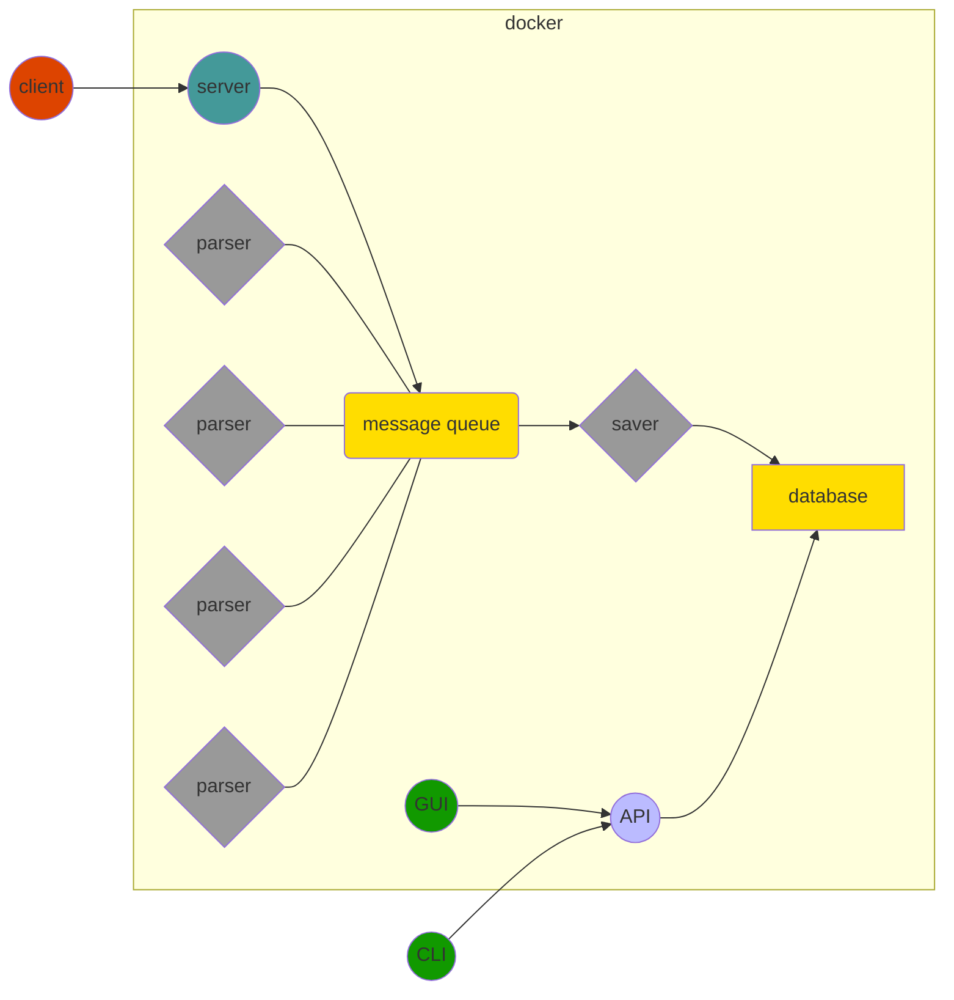

# BrainStorm

Brain computer interface project for advanced system design course in TAU.

See API documentation [here](https://brainstormproject.readthedocs.io/en/latest/).

## Overview

This project includes a [client](#Client), which streams cognition snapshots to a [server](#Server), which then publishes them to a [message queue](#Message-Queue), where multiple [parsers](#Parsers) read the snapshot, parse various parts of it, and publish the parsed results, which are then [saved](#Saver) to a [database](#Database).

The results are then exposed via a RESTful [API](#API), which is consumed by a [CLI](#CLI); there's also a [GUI](#GUI), which visualizes the results in various ways.



## Installation

1. Clone the repository and enter it:

    ```sh
    $ git clone git@github.com:ShaiRT/BrainStorm.git
    ...
    $ cd BrainStorm/
    ```

2. Run the installation script and activate the virtual environment:

    ```sh
    $ ./scripts/install.sh
    ...
    $ source .env/bin/activate
    [brainstorm] $ # you're good to go!
    ```

3. To check that everything is working as expected, run the tests:

    ```sh
    $ ./scripts/run-tests.sh
    ...
    ```

## Usage

### Running the pipeline

To run the entire pipeline, run:
```sh
$ ./run-pipeline.sh
```
This will run the follwing services on a [Docker]([https://www.docker.com/](https://www.docker.com/)) host:

|program   |host         |port|protocol  |package            |
|----------|-------------|----|:--------:|-------------------|
|server    |0 . 0 . 0 . 0|8000|http      |`brainstorm.server`|
|api server|0 . 0 . 0 . 0|5000|http      |`brainstorm.api`   |
|gui server|0 . 0 . 0 . 0|8080|http      |`brainstorm.gui`   |

> Note: this will also run docker containers with [rabbitmq](https://www.rabbitmq.com/) on 0.0.0.0:5672, and [mogodb](https://www.mongodb.com/) on 0.0.0.0:27017.

This will also activate a `brainstorm.saver` and the following parsers:

- color image parser
- depth image parser
- feelings parser
- pose parser

See [Client](#Client) to learn about uploading data to the server, and [CLI](#CLI) to learn how to access the information via command line.

### Command Line Interface

> Note:
> In all of the following commands, message queue and database urls must be in the form `'scheme://host:port'`. The scheme must be supported by `brainstorm.mq_draivers` and `brainstorm.database_drivers`, and the message queue / database are assumed to already be running in the given host and port.

#### Client

To upload data to the server, use the clients upload-sample command:
```
$ python -m brainstorm.client upload-sample --help
Usage: __main__.py upload-sample [OPTIONS] PATH

  Upload a sample in given path to the server. The snapshots are POSTed to
  http://host:port/snapshot in bson format

Options:
  -h, --host TEXT            ip address of the server  [default: 127.0.0.1]
  -p, --port INTEGER         the server port  [default: 8000]
  -rd, --reader-driver TEXT  a driver for the sample reader (from
                             brainstorm.reader_drivers)  [default: protobuf]
  -t, --traceback            show full traceback on failure  [default: False]
  --help                     Show this message and exit.
```

To view information in a sample in command line without sending to server use the clients read command:
```
$ python -m brainstorm.client read --help
Usage: __main__.py read [OPTIONS] PATH

  Read the sample in given path and print the information.

Options:
  -d, --driver TEXT  the name of the driver for the sample - must be a driver
                     from brainstorm.reader_drivers  [default: protobuf]
  --help             Show this message and exit.
```

#### Server

To run the server use the following command:
```
$ python -m brainstorm.server run-server --help
Usage: __main__.py run-server [OPTIONS] URL

  run the server to recieve snapshots and post to a message queue in given
  url.

Options:
  -h, --host TEXT     the server host  [default: 127.0.0.1]
  -p, --port INTEGER  the server port  [default: 8000]
  --path TEXT         directory for blob storage  [default: data]
  -t, --traceback     show full traceback on failure  [default: False]
  --help              Show this message and exit.
```
 
#### Message Queue

Various parts of this project use a message queue to publish and consume information.
The current implementation support [RabbitMQ](https://www.rabbitmq.com/) as a message queue.

#### Parsers

`brainstorm.parsers` provides the following command line interface:
```
$ python -m brainstorm.parsers parse --help
Usage: __main__.py parse [OPTIONS] NAME PATH

  parse snapshot data in given path with parser with given name and print
  result

Options:
  --help  Show this message and exit.
```
```
$ python -m brainstorm.parsers run-parser --help
Usage: __main__.py run-parser [OPTIONS] NAME URL

  run parser with given name to listen to message queue in given url, parse
  data, and post back to 'data' topic exchange of the  message queue with
  routing_key=name.

Options:
  --help  Show this message and exit.
```
To add parsers to the `brainstorm.parsers` package, simply add a `.py` file to the packge containing a `parse_parser_name(snapshot)` function or a `ParserNameParser` class with a `self.parse(snapshot)` method.
** files starting with `_` will be ignored.

#### Saver

```
$ python -m brainstorm.saver save --help
Usage: __main__.py save [OPTIONS] PATH

  Save data in given path to database in given url

Options:
  -d, --database TEXT  the url of the database  [default:
                       mongodb://localhost:27017/]
  --help               Show this message and exit.
```
```
$ python -m brainstorm.saver run-saver --help
Usage: __main__.py run-saver [OPTIONS] DATABASE_URL MQ_URL

  Run the saver to save messages from message queue in given url to
  database. The saver saves all messages received in 'data' topic exchange.

Options:
  --help  Show this message and exit.
```

#### Database

Various parts of this project use a database to save and read information.
The current implementation support [MongoDB](https://www.mongodb.com/) as a message queue.

#### API

To run `brainstorm.api` simply use
```
$ python -m brainstorm.api run-server --help
Usage: __main__.py run-server [OPTIONS]

  Run the api server to respond to http requests at 'http://host:port' and
  expose the data in the database.

Options:
  -h, --host TEXT      the servers host  [default: 127.0.0.1]
  -p, --port INTEGER   the servers port  [default: 5000]
  -d, --database TEXT  the url of the database  [default:
                       mongodb://localhost:27017]
  --help               Show this message and exit.
```
The api server will respond to the following requests:

- GET /users  
  Returns a list of IDs and names of all supported users.
 
- GET /users/\<user-id>
  Returns the specified user's details: ID, name, birthday and gender.
 
- GET /users/\<user-id>/snapshots  
  Returns a list of the specified user's snapshot IDs and datetimes.
 
- GET /users/\<user-id>/snapshots/\<snapshot-id>
  Returns the specified snapshot's details: ID, datetime, and the available results' names.
 
- GET /users/\<user-id>/snapshots/\<snapshot-id>/\<result-name>  
  Returns the specified snapshot's result (if available).
 
- GET /users/\<user-id>/snapshots/\<snapshot-id>/\<result-name>/data
  Returns the specified snapshot's result data (i.e. image).
  Supported results: color_image, depth_image (if available).

#### CLI

The cli is available via `brainstorm.cli` and supports the following commands:
```
$ python -m brainstorm.cli get-users --help
Usage: __main__.py get-users [OPTIONS]

  Print a list of IDs and names of all supported users.

Options:
  -h, --host TEXT     the api host  [default: 127.0.0.1]
  -p, --port INTEGER  the api port  [default: 5000]
  --help              Show this message and exit.
```
```
$ python -m brainstorm.cli get-user --help
Usage: __main__.py get-user [OPTIONS] USER_ID

  Print the specified user’s details: ID, name, birthday and gender.

Options:
  -h, --host TEXT     the api host  [default: 127.0.0.1]
  -p, --port INTEGER  the api port  [default: 5000]
  --help              Show this message and exit.
```
```
$ python -m brainstorm.cli get-snapshots --help
Usage: __main__.py get-snapshots [OPTIONS] USER_ID

  Print a list of the specified user’s snapshot IDs and datetimes.

Options:
  -h, --host TEXT     the api host  [default: 127.0.0.1]
  -p, --port INTEGER  the api port  [default: 5000]
  --help              Show this message and exit.
```
```
$ python -m brainstorm.cli get-snapshot --help
Usage: __main__.py get-snapshot [OPTIONS] USER_ID SNAPSHOT_ID

  Print the specified snapshot’s details: ID, datetime, and the available
  results’ names.

Options:
  -h, --host TEXT     the api host  [default: 127.0.0.1]
  -p, --port INTEGER  the api port  [default: 5000]
  --help              Show this message and exit.
```
```
$ python -m brainstorm.cli get-result --help
Usage: __main__.py get-result [OPTIONS] USER_ID SNAPSHOT_ID RESULT_NAME

  Print the specified snapshot’s result (if available). When given a path,
  the result is saved to the path in json format instead of being printed.

Options:
  -h, --host TEXT     the api host  [default: 127.0.0.1]
  -p, --port INTEGER  the api port  [default: 5000]
  -s, --save TEXT
  --help              Show this message and exit.
```
> Make sure the api server is running on the default host and port (or specify a different host and port) before running the cli commands.

#### GUI
Run the gui server to server results at `'http://host:port'`:
```
$ python -m brainstorm.gui run-server --help
Usage: __main__.py run-server [OPTIONS]

  Run the gui server at 'http:host:port' The gui server displays the
  information exposed by the api server.

Options:
  -h, --host TEXT         the gui server host  [default: 127.0.0.1]
  -p, --port INTEGER      the gui server port  [default: 8080]
  -H, --api-host TEXT     the api server host  [default: 127.0.0.1]
  -P, --api-port INTEGER  the api server port  [default: 5000]
  -t, --traceback         show full traceback on failure  [default: False]
  --help                  Show this message and exit.
```

